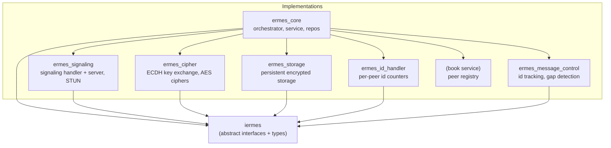
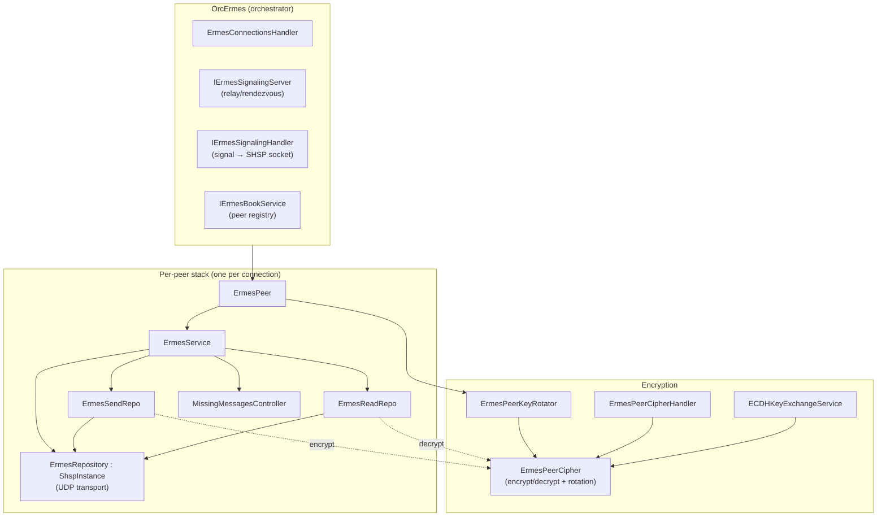

# Protocol Architecture

ErmesDart is a peer-to-peer encrypted messaging protocol. Peers discover each
other through a signaling rendezvous, punch a hole through NAT with STUN,
establish a UDP socket via SHSP (Single Hand Shake Protocol), and then exchange
encrypted, reliable, fragmented messages.

This document gives the structural map. The per-flow sequences live in the
sibling documents linked from [README.md](README.md).

## Package layout

Interfaces live in `iermes`; every other package is an implementation that
depends on the interfaces, never the reverse.

## Runtime component map

A single `OrcErmes` orchestrator owns the signaling and connection machinery.
Each established peer gets its own `ErmesPeer` → `ErmesService` stack.

## Layered responsibilities

| Layer | Component(s) | Responsibility |
|---|---|---|
| Orchestration | `OrcErmes`, `ErmesConnectionsHandler` | Open/close connections, hold the peer map |
| Discovery | `IErmesSignalingServer`, `IErmesSignalingHandler`, STUN | Exchange signals, discover public address, SHSP handshake |
| Session | `ErmesPeer`, `ErmesService` | Per-peer lifecycle, wire send/receive, dispatch service messages |
| Reliability | `ErmesSendRepo`, `ErmesReadRepo`, `MissingMessagesController`, `IErmesMessageControlService` | Fragmentation, reassembly, dedup, gap detection, retransmission |
| Security | `ECDHKeyExchangeService`, `ErmesPeerCipher`, `ErmesPeerKeyRotator` | Key exchange, symmetric encryption, key rotation |
| Transport | `ErmesRepository` (`ShspInstance`) | UDP send/receive over the SHSP socket |
| Persistence | `IErmesStorageAndCachingMessages` | Store sent roots (retransmission) and received messages (dedup/reassembly) |

## Core interfaces (`iermes`)

`Repository`, `Service`, `Peer`, `Orchestrator`, `SignalingHandler`,
`SignalingServer`, `Storage`, `IdHandler`, `Connection`, `MessageControl`. Each
implementation references only these abstractions, which keeps the transport,
crypto, and storage backends swappable and the suite testable against
interfaces rather than concrete classes.
