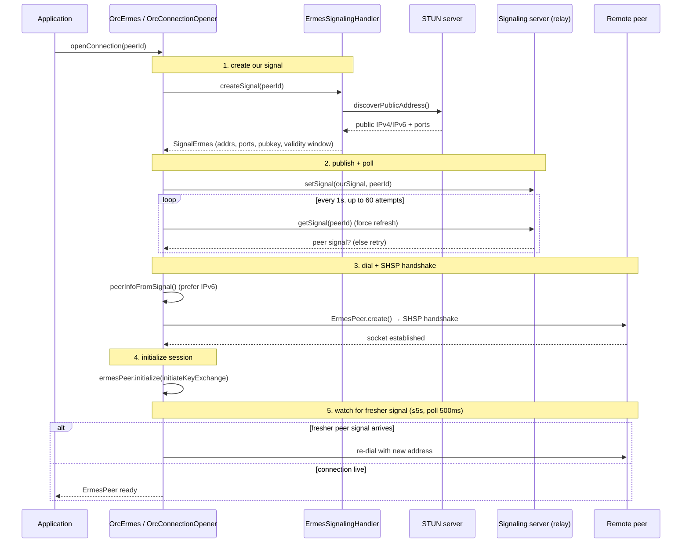

# Connection Establishment

This document covers the **orchestrator-level** flow that turns a call to
`OrcErmes.openConnection(peerId)` into a live, ready `ErmesPeer`. It builds on
the lower-level SHSP exchange described in
[signaling_handshake.md](signaling_handshake.md).

`OrcConnectionOpener` drives the flow: discover our address, publish a signal,
poll the relay for the peer's signal, dial, and watch for a fresher signal so we
can re-dial against a more recent NAT mapping.

## Sequence

## Steps

1. **Signal creation.** `createSignal(peerId)` runs STUN discovery
   (`discoverPublicAddress`) with a multi-strategy fallback: a fresh socket to a
   custom STUN server if configured, then a shared STUN handler (5 retries,
   500 ms backoff), then a local-hostname fallback that always succeeds. The
   result is a `SignalErmes` with IPv4/IPv6 addresses, ports, public key, and a
   validity window (~10 min).
2. **Publish.** `signalingServer.setSignal(ourSignal, peerId)` writes the signal
   to the relay (compressed get/set on the server side).
3. **Poll for peer signal.** `_waitForPeerSignal()` polls every second (max
   60 = 60 s timeout), forcing a relay refresh each time to dodge stale cache.
4. **Dial.** `peerInfoFromSignal()` extracts the reachable address (IPv6
   preferred), then `ErmesPeerFactory.create()` builds the `ErmesRepository`
   (an `ShspInstance`) which immediately sends the SHSP handshake and
   auto-responds to the peer's handshake.
5. **Initialize.** `ermesPeer.initialize(initiateKeyExchange: enableEncryption)`
   wires message/disconnect listeners and starts `ErmesPeerKeyRotator` when
   encryption is on (see [encryption.md](encryption.md)).
6. **Watch for a fresher signal.** `_awaitConnectionOrFresher()` polls for up to
   5 s (or `connectionTimeoutMs`, whichever is shorter) every 500 ms. If the peer
   republishes a newer signal (e.g. its NAT mapping changed), the opener
   re-dials against the new address; otherwise the live connection wins.

## Failure / reconnect

- If no peer signal appears within the poll budget, the open fails.
- A dropped socket is retried by `ErmesSignalingReconnector` with bounded,
  exponentially backed-off attempts (`clearConnection` / `softClearConnection`
  manage the per-peer socket and callbacks).
