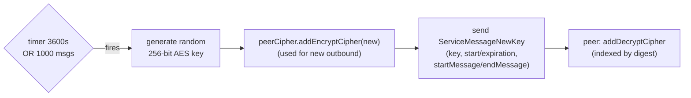
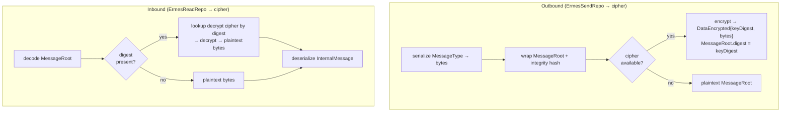

# Encryption & Key Exchange

ErmesDart encrypts message payloads with symmetric AES ciphers whose keys are
derived from an ECDH (P-256) exchange and then rotated periodically. Each peer
keeps a list of ciphers per direction so that in-flight messages encrypted with
an older key still decrypt during a rotation.

- **Key agreement:** `ECDHKeyExchangeService` (P-256).
- **Per-peer ciphers:** `ErmesPeerCipher` (via `ErmesPeerCipherHandler`).
- **Rotation:** `ErmesPeerKeyRotator`.
- **Distribution:** `ServiceMessageNewKey` control messages.

## Initial key exchange

```mermaid
sequenceDiagram
    participant A as Peer A
    participant B as Peer B

    Note over A,B: after SHSP socket is established
    A->>A: ECDH generateNew() → P-256 keypair
    A->>A: generateSharedSecret(B.pubKey) → AES-256 cipher
    A->>A: peerCipher.addEncryptCipher(cipher)
    A->>B: ServiceMessageNewKey(algorithm, key, validity window)
    Note over B: handleNewKeyMessage()
    B->>B: peerCipher.addDecryptCipher(cipher) (indexed by key digest)
    Note over A,B: A→B traffic now encrypted; B does the symmetric reverse
```

Each direction is independent: a key A sends in a `ServiceMessageNewKey` becomes
**A's encrypt cipher** and **B's decrypt cipher**. For two-way encryption both
peers perform the exchange.

## Key rotation

`ErmesPeerKeyRotator` rotates on whichever trigger fires first:

- a periodic timer (default **3600 s**), or
- a message counter (default every **1000 messages**).



`ErmesPeerCipher` keeps an ordered list per direction and always encrypts with
the first valid cipher (index 0). Expired ciphers are pruned lazily during
encrypt/decrypt, so old keys survive long enough to decrypt messages that were
already in flight.

## Per-message encrypt / decrypt



The `digest` carried on `MessageRoot` is the SHA-256 of the key, which lets the
receiver pick the exact cipher to decrypt with — essential while multiple keys
are valid mid-rotation. If no matching cipher is found, decryption throws.

## `ServiceMessageNewKey` fields

| Field | Meaning |
|---|---|
| `algorithm` | `CryptoAlgorithm` — AES (default), DES, HMAC |
| `key` | hex-encoded symmetric key material |
| `start` / `expiration` | validity window (optional) |
| `startMessage` / `endMessage` | first/last message id this key covers (optional) |
