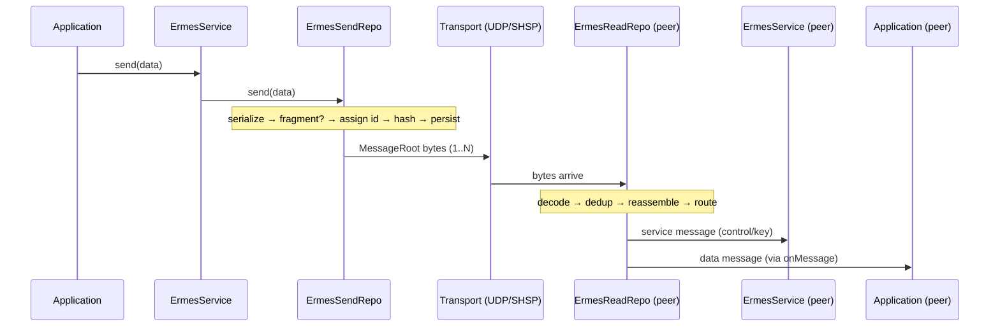

# Message Lifecycle

This document describes how application data travels from `OrcErmes.send()` on
the sender to the message callbacks on the receiver. Two pipelines are
involved: the **send pipeline** (`ErmesSendRepo`) and the **receive pipeline**
(`ErmesReadRepo`), coordinated on each side by `ErmesService`.

## High-level overview

## Send pipeline — `ErmesSendRepo`

`ErmesSendRepo.send(rawData)` decides between a single message and a fragmented
sequence based on `_maxByte` (the configured max payload plus header room):

1. **Fragmentation decision.** If `rawData.length > _maxByte`, the data is
   split; otherwise it is sent as a single `MessageData`.
2. **Fragmentation (`chunkArrayBuffer`).** A random `refId` (UUID v4) ties all
   chunks of one logical message together. The buffer is sliced into
   `ceil(total / chunkSize)` pieces (`chunkSize = _maxByte - 300`, leaving room
   for per-chunk headers). Each `ChunkMessage` carries:
   - `index` — its position (0-based),
   - `roof` — the total number of chunks (so the receiver knows when complete),
   - `refId` — the shared message id,
   - `id` — a unique id from the `IdHandler`.
3. **Root building & integrity (`sendMessageType`).** Each `MessageType`
   (data / chunk / service) is wrapped into a `MessageRoot` via
   `buildMessageRoot`, which adds the integrity hash used for deduplication on
   the far side.
4. **Persist for retransmission.** Each `MessageRoot` is stored
   (`storageRoot.store`) keyed by message id so `sendAgain(id)` can resend it
   when the peer reports a gap.
5. **Dispatch (`_sendRootMessage`).** The root is serialized
   (`objectToUint8Array`) and handed to the transport. A 1 ms yield after each
   send lets the OS flush the UDP socket buffer, avoiding overflow on large
   fragmented messages.

Send listeners (`onMessageSending` / `onMessageSent`) fire around each step so
higher layers (e.g. key rotation, metrics) can react.

## Receive pipeline — `ErmesReadRepo`

Inbound bytes arrive through `_handleMessageArrayBuffer` and flow as follows:

1. **Decode & deduplicate (`decodeMessageEnvelope`).** The envelope is decoded
   and its integrity hash checked against `_processedHashes`. Already-seen
   hashes are dropped (idempotent delivery), so retransmissions are harmless.
2. **Deserialize.** The plaintext bytes are turned into an `InternalMessage`.
3. **Bookkeeping.** The message id is reported to the message-control service
   (`idArrived`) for gap detection, and the message is stored.
4. **Route by type (`_routeDataMessage`):**
   - **service** → dispatched to the service-message listeners (connection
     close, control/acknowledge, array-request, new-key).
   - **base (data)** → pushed onto the not-yet-read queue.
   - **chunk** → handed to chunk reassembly.
5. **Chunk reassembly (`ChunkHandler`).** Chunks sharing a `refId` accumulate
   in a per-message `ChunkHandler`. It validates each `index` against `roof`
   and the running total against `maxTotalSize`, ignores duplicates, and once
   all `roof` chunks are present it concatenates them in index order and emits
   the reassembled buffer. `getMissingChunkIndices()` reports holes for
   retransmission requests.
6. **Delivery.** Completed buffers are pushed onto `ObservableQueue`, whose
   `onAddCallback` drains the queue to the registered data-arrived listeners.

## Reliability hooks

- **Deduplication** by integrity hash makes redelivery safe.
- **Message-control** tracks received ids; `ErmesService` reacts to gaps by
  requesting missing ids and resending via `ErmesSendRepo.sendAgain`.
- **Persistence** of sent roots enables retransmission without re-fragmenting.
