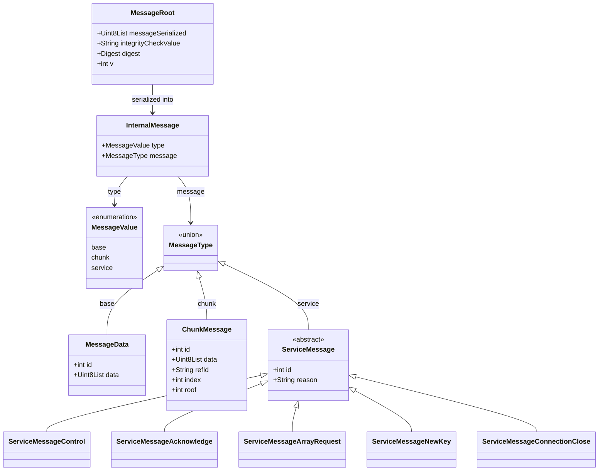
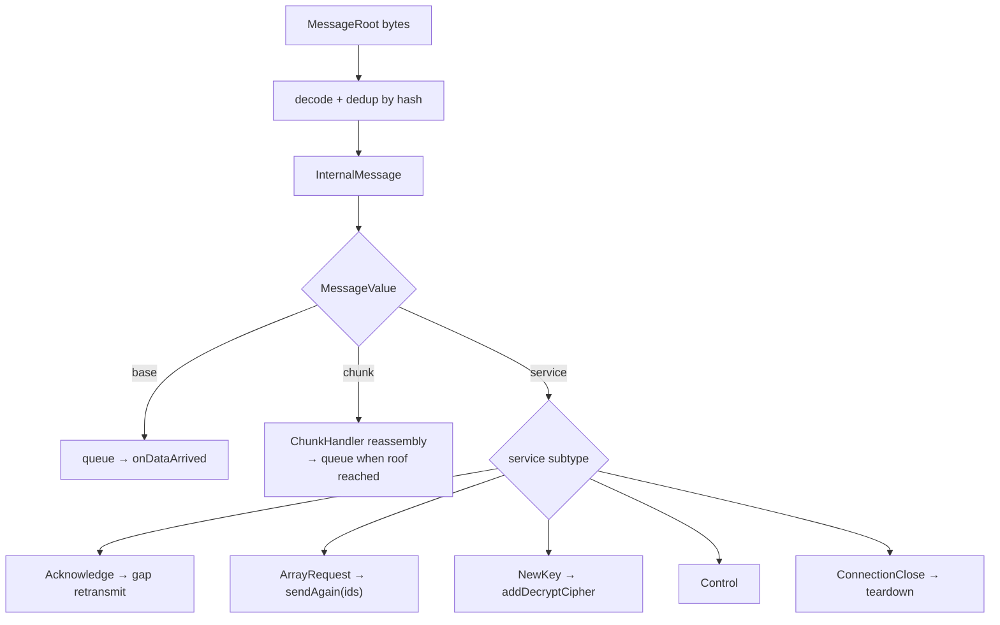

# Message Types

Every wire unit is a `MessageRoot` envelope carrying a serialized
`InternalMessage`. The `InternalMessage` discriminates between three payload
kinds via `MessageValue`: a single data message, a fragment (chunk), or a
service (control) message.

## Type hierarchy

## Envelope: `MessageRoot`

| Field | Purpose |
|---|---|
| `messageSerialized` | binary serialized `InternalMessage` (plaintext or encrypted) |
| `integrityCheckValue` | SHA-256 hash; used for receiver-side deduplication |
| `digest` | key id (SHA-256 of the key) — present only when encrypted |
| `v` | protocol version |

## Payloads

### `MessageData` (`MessageValue.base`)
A complete, non-fragmented user message. `id` is the per-peer counter value;
`data` is the payload (up to ~1299 bytes before fragmentation kicks in).

### `ChunkMessage` (`MessageValue.chunk`)
One fragment of a larger message. All chunks of the same logical message share a
`refId` (UUID v4); `index` is the 0-based position and `roof` is the total count,
so the receiver knows when reassembly is complete (~1000 bytes per chunk).

### Service messages (`MessageValue.service`)

| Type | `reason` | Carries | Role |
|---|---|---|---|
| `ServiceMessageControl` | `c` | — | generic control signal |
| `ServiceMessageAcknowledge` | `a` | `ackCurrentId`, `ackLastReceivedId` | report receive progress → drives gap retransmission |
| `ServiceMessageArrayRequest` | `array` | `arrayId: List<int>` | explicit re-request of specific ids |
| `ServiceMessageNewKey` | `newkey` | `algorithm`, `key`, validity window | distribute a rotated symmetric key |
| `ServiceMessageConnectionClose` | `x` | — | signal graceful teardown |

## Routing on receive

Cross-references: [message_lifecycle.md](message_lifecycle.md) (send/receive
pipeline), [encryption.md](encryption.md) (NewKey handling),
[retransmission.md](retransmission.md) (Acknowledge / ArrayRequest handling).
