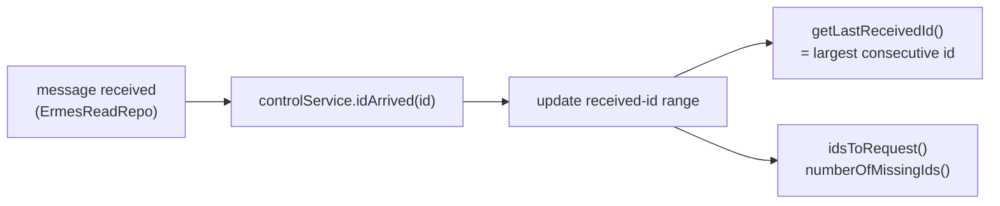
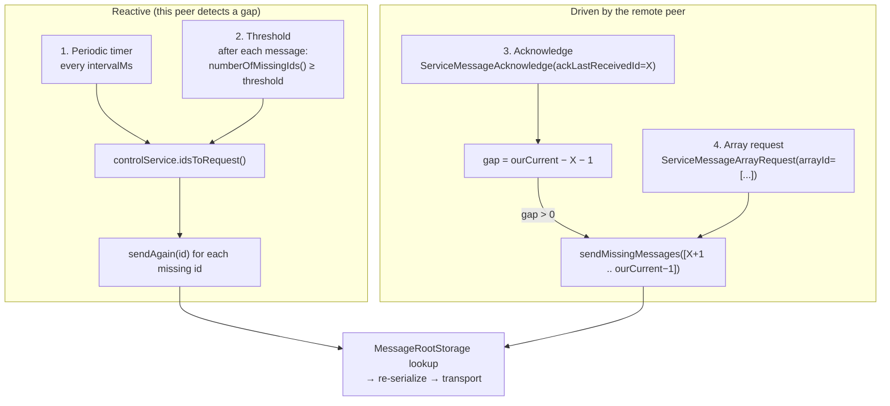
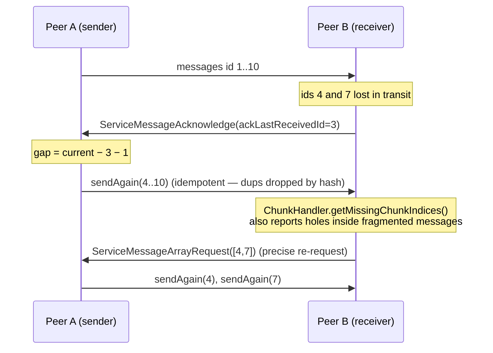

# Reliability & Retransmission

The transport is UDP, so the protocol layers reliability on top: every sent
`MessageRoot` is persisted, every received id is tracked, and gaps trigger
retransmission. `MissingMessagesController` drives retransmission;
`IErmesMessageControlService` tracks which ids have arrived.

## Id tracking

`getLastReceivedId()` returns the largest id received with no gaps before it —
that is the value reported to the peer in an acknowledge.

## The four retransmission paths

| # | Path | Trigger | Who decides |
|---|---|---|---|
| 1 | Periodic timer | `Timer.periodic(intervalMs)` | local |
| 2 | Threshold | after a message, missing count ≥ threshold | local |
| 3 | Acknowledge | peer sends `ServiceMessageAcknowledge` | remote (gap computed locally) |
| 4 | Array request | peer sends `ServiceMessageArrayRequest` | remote (explicit id list) |

## Acknowledge round-trip

## Why retransmission is safe

- **Persistence:** `MessageRootStorage` keeps each sent root keyed by id, so
  `sendAgain(id)` resends the exact bytes without re-fragmenting or re-hashing.
- **Deduplication:** the receiver drops any root whose integrity hash is already
  in `_processedHashes`, so resends and duplicates are harmless.
- **Fragment-aware:** `ChunkHandler.getMissingChunkIndices()` exposes holes
  within a fragmented message so only the missing chunks need re-requesting.

See [message_lifecycle.md](message_lifecycle.md) for the full send/receive
pipeline these hooks plug into.
