# ErmesDart Project Architecture

## Class Hierarchy & Dependencies Diagram

```mermaid
flowchart TD
    subgraph INTERFACES["INTERFACES"]
        IErmesService["IErmesService<br/>send() sendNewKey()<br/>startMissingMessagesCheck()"]
        IErmesRepository["IErmesRepository<br/>send() addOnMessageDataListener()"]
        IErmesMessageControlService["IErmesMessageControlService<br/>idArrived() idsToRequest()"]
        IIdHandlerService["IIdHandlerService<br/>getNewId() setCounter()"]
        IErmesSignalingHandler["IErmesSignalingHandler<br/>createSignal() processSignal()"]
        IErmesBookService["IErmesBookService<br/>setAccount() getAccount()"]
        IErmesPeer["IErmesPeer<br/>send() initialize() dispose()"]
    end

    subgraph CORE["CORE LAYER"]
        ErmesService["<b>ErmesService</b><br/>implements IErmesService<br/>---<br/>Coordina send/read repos<br/>Gestisce retransmissioni"]
        ErmesSendRepo["<b>ErmesSendRepo</b><br/>---<br/>Serializzazione e frammenti<br/>Crittografia e hashing"]
        ErmesReadRepo["<b>ErmesReadRepo</b><br/>---<br/>Deserialization<br/>Decrittografia e verifica"]
        ErmesRepository["<b>ErmesRepository</b><br/>implements IErmesRepository<br/>extends ShspInstance<br/>---<br/>Trasporto basso livello"]
    end

    subgraph CONTROL["MESSAGE CONTROL LAYER"]
        ErmesMessageControlService["<b>ErmesMessageControlService</b><br/>implements IErmesMessageControlService<br/>---<br/>Gap detection & tracking<br/>4 retransmission paths"]
        ErmesMessageControlRepository["<b>ErmesMessageControlRepository</b><br/>---<br/>Tracking ID ricevuti"]
    end

    subgraph SIGNALING["SIGNALING LAYER"]
        ErmesSignalingHandler["<b>ErmesSignalingHandler</b><br/>implements IErmesSignalingHandler<br/>---<br/>NAT traversal & handshake<br/>Connection management"]
        ErmesBookService["<b>ErmesBookService</b><br/>implements IErmesBookService<br/>Singleton<br/>---<br/>Peer directory"]
        ErmesBookRepository["<b>ErmesBookRepository</b><br/>---<br/>Persistenza contatti"]
    end

    subgraph IDHANDLER["ID HANDLER LAYER"]
        IdHandlerService["<b>IdHandlerService</b><br/>implements IIdHandlerService<br/>---<br/>Generazione ID unici"]
    end

    subgraph PEER["PEER LAYER"]
        ErmesPeer["<b>ErmesPeer</b><br/>implements IErmesPeer<br/>---<br/>Facade ad alto livello<br/>Offline queueing"]
        ErmesConnection["<b>ErmesConnection</b><br/>---<br/>Gestione connessione<br/>Riconnessione logica"]
    end

    subgraph AUXILIARY["AUXILIARY"]
        ErmesPeerCipherHandler["<b>ErmesPeerCipherHandler</b><br/>Singleton<br/>---<br/>Encryption key management"]
        ChunkHandler["<b>ChunkHandler</b><br/>---<br/>Fragment assembly"]
        ShspInstance["<b>ShspInstance</b><br/>---<br/>SHSP protocol base"]
    end

    %% Implementations
    ErmesService -->|implements| IErmesService
    ErmesRepository -->|implements| IErmesRepository
    ErmesMessageControlService -->|implements| IErmesMessageControlService
    IdHandlerService -->|implements| IIdHandlerService
    ErmesSignalingHandler -->|implements| IErmesSignalingHandler
    ErmesBookService -->|implements| IErmesBookService
    ErmesPeer -->|implements| IErmesPeer

    %% Inheritance
    ErmesRepository -->|extends| ShspInstance

    %% Core layer dependencies
    ErmesService -->|uses| ErmesSendRepo
    ErmesService -->|uses| ErmesReadRepo
    ErmesService -->|uses| IErmesMessageControlService

    ErmesSendRepo -->|uses| IErmesRepository
    ErmesSendRepo -->|uses| IIdHandlerService
    ErmesSendRepo -->|uses| ErmesPeerCipherHandler

    ErmesReadRepo -->|uses| IErmesRepository
    ErmesReadRepo -->|uses| IErmesMessageControlService
    ErmesReadRepo -->|uses| ErmesPeerCipherHandler
    ErmesReadRepo -->|uses| ChunkHandler

    %% Message Control
    ErmesMessageControlService -->|uses| ErmesMessageControlRepository

    %% Signaling
    ErmesSignalingHandler -->|uses| IErmesBookService
    ErmesSignalingHandler -->|uses| ShspInstance
    ErmesBookService -->|uses| ErmesBookRepository

    %% Peer layer
    ErmesPeer -->|uses| IErmesService
    ErmesPeer -->|uses| ErmesPeerCipherHandler
    ErmesConnection -->|uses| IErmesSignalingHandler
    ErmesConnection -->|uses| IErmesRepository

    style ErmesService fill:#4A90E2,color:#fff
    style ErmesSendRepo fill:#4A90E2,color:#fff
    style ErmesReadRepo fill:#4A90E2,color:#fff
    style ErmesRepository fill:#4A90E2,color:#fff
    style ErmesMessageControlService fill:#7ED321,color:#fff
    style IdHandlerService fill:#9013FE,color:#fff
    style ErmesSignalingHandler fill:#F5A623,color:#fff
    style ErmesBookService fill:#F5A623,color:#fff
    style ErmesPeer fill:#50E3C2,color:#fff
    style ErmesPeerCipherHandler fill:#B8E986,color:#000
    style IErmesService fill:#E8E8E8,color:#000,stroke:#666,stroke-width:2px
    style IErmesRepository fill:#E8E8E8,color:#000,stroke:#666,stroke-width:2px
    style IErmesMessageControlService fill:#E8E8E8,color:#000,stroke:#666,stroke-width:2px
    style IIdHandlerService fill:#E8E8E8,color:#000,stroke:#666,stroke-width:2px
    style IErmesSignalingHandler fill:#E8E8E8,color:#000,stroke:#666,stroke-width:2px
    style IErmesBookService fill:#E8E8E8,color:#000,stroke:#666,stroke-width:2px
    style IErmesPeer fill:#E8E8E8,color:#000,stroke:#666,stroke-width:2px
```

## Legenda

| Colore | Strato | Descrizione |
|--------|--------|-------------|
| Blu scuro | Core Layer | Servizi e repository principali per messaggistica |
| Verde | Message Control | Tracciamento ID e rilevamento gap |
| Viola | ID Handler | Generazione ID unici |
| Arancione | Signaling | Handshake e gestione connessioni |
| Turchese | Peer | API ad alto livello |
| Giallo-verde | Auxiliary | Classi di supporto |
| Grigio | Interfaces | Interfacce astratte |

## Relazioni

- **→ implements**: La classe implementa l'interfaccia
- **→ extends**: Ereditarietà da classe base
- **→ uses**: Dipendenza/utilizzo

## Architettura per Strati

### 1. **CORE LAYER** (Trasporto e Serializzazione)
- **ErmesService**: Coordinatore principale, gestisce retransmissioni
- **ErmesSendRepo**: Serializzazione, frammentazione, crittografia
- **ErmesReadRepo**: Deserialization, decrittografia, assemblaggio
- **ErmesRepository**: Trasporto SHSP basso livello

### 2. **MESSAGE CONTROL LAYER** (Rilevamento Gap)
- 4 percorsi di retransmissione:
  - Acknowledge-based
  - Array request
  - Periodic timer
  - Threshold-based

### 3. **SIGNALING LAYER** (Connessioni P2P)
- NAT traversal via STUN
- Handshake peer-to-peer
- Directory contatti

### 4. **PEER LAYER** (API Ad Alto Livello)
- Facade semplificato
- Offline queueing
- Reconnection logic

### 5. **AUXILIARY** (Supporto)
- Encryption key management (Singleton)
- Fragment assembly
- SHSP protocol base
